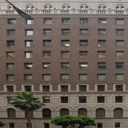

# Focal-Frequency-Loss
This repository tries to implement [Focal Frequency Loss for Image Reconstruction and Synthesis](https://arxiv.org/abs/2012.12821) by pytorch

```./utils/ffl.py``` is a focal frequency loss that is implemented based on the paper for the pix2pix
## Reference
 [[pix2pix](https://github.com/junyanz/pytorch-CycleGAN-and-pix2pix)] pytorch-CycleGAN_and-pix2pix   
 [[fid](https://github.com/mseitzer/pytorch-fid)] pytorch-fid
 
## Environment
 Ubuntu 16.04   
 Pytorch 1.9.0   
 Python 3.7.10   
 Numpy 1.21.1   
## Dataset
 Trained on [CMP Facades Datasets](https://cmp.felk.cvut.cz/~tylecr1/facade/)    
 * Download a pix2pix dataset   
 
     ```        
     bash ./datasets/download_pix2pix_dataset.sh facades     
     ```
## Train
```python train.py --dataroot ./datasets/facades --name facads_pix2pix --model pix2pix --direction BtoA --checkpoints_dir [Checkpoint path] --gpu_ids [GPU Number]```   
gpu_ids, checkpoints_dir option are additional thing.
* Detail Options     

 |contents|values|
|:---:|:---:|
|Spatial loss | L1, Vanilla GAN Loss   |
|Learning rate | 0.0002   |
|Adam | beta1 : 0.5 beta 2 : 0.999   |
|Init network parameters | Normal initialize(mean : 0.0, std : 0.02)   |
|Batch size | 1|
## Pre-trained model   
* Download pre-trained model   
 ```bash ./scripts/download_pix2pix_model.sh facades_label2photo```   
 
## Test
* Generate images with testset   
```python test.py --dataroot ./datasets/facades/ --direction BtoA --model pix2pix --name [Checkpoint path]/facades_pix2pix --gpu_ids [GPU Number]```
## Example
| |A|B|
|:---:|:---:|:---:|
|mask/edge|||
|real|||
|w/o FFL|||
|w/ FFL|||
## Metric
- [x] : FID
- [ ] : IS   
   
 | Model | FID | IS |
 |:---:|:----:|:---:|
 | pix2pix(pretrained)| 128.7069 | Add Later |
 | pix2pix + FFL | 125.4260 | Add Later |
